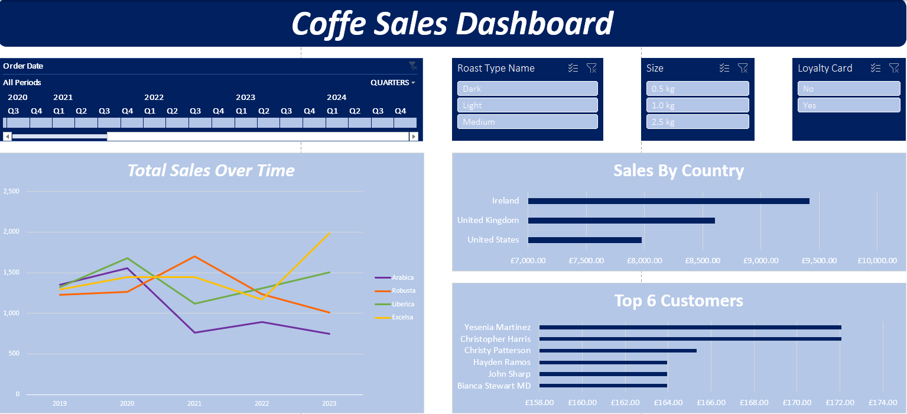
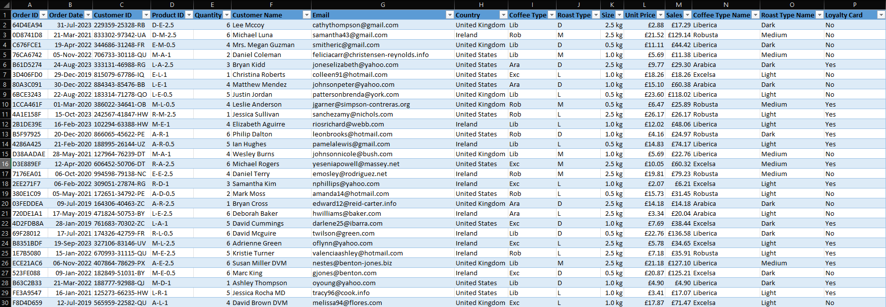
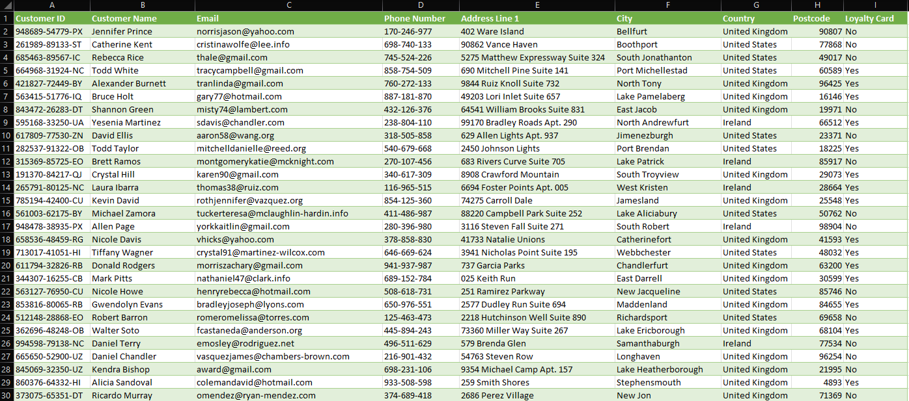

☕ Coffee Sales Dashboard

📌 Project Description
This project is an interactive sales dashboard built in Microsoft Excel. Its purpose is to visualize and analyze coffee sales data using three key datasets: Orders, Products, and Customers.

For those who do not wish to download the file, screenshots of the most important project sheets are included below.

Project Screenshots

Dashboard Sheet

Orders Sheet

Customers Sheet

